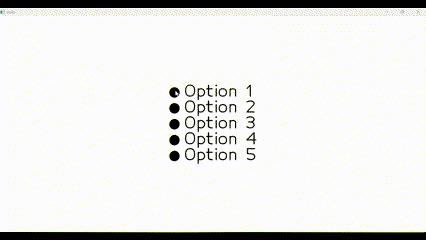
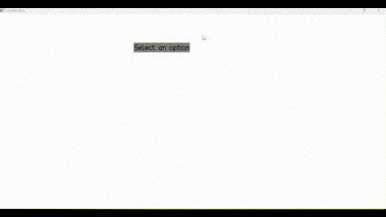
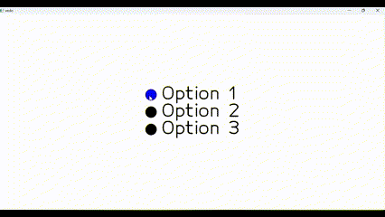
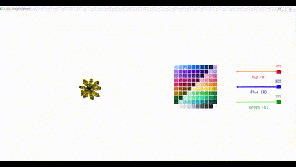
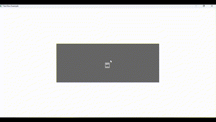
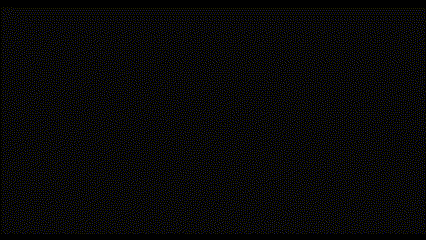
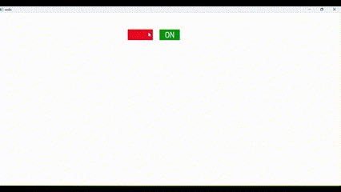
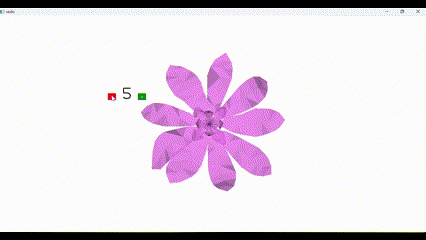

# Vedo UI Extensions
A collection of UI components and tools implemented using the Vedo library in Python.

## Description
This project extends the Vedo library with additional UI components and tools such as ComboBox, RadioButton, CheckBox, TextBox, TextEditor, ToggleSwitch, ColorPicker, and Adder. These components provide enhanced interactivity and user input capabilities for Vedo-based applications.

## Clone Project 
git clone https://github.com/aishadahesh/Vedo-UI-Extensions.git

## Installation
To install the necessary dependencies, run:
' pip install vedo '

## Overview:

1. **Check Box:**
A set of selectable options represented as checkboxes.
  

2. **Combo Box:**
A dropdown menu for selecting options.
  

3. **Radio Button:**
A set of mutually exclusive options represented as radio buttons.
  

4. **Color Picker:**
A color picker tool for adjusting the color of meshes.
  

5. **Text Box:**
 - **Version 1:**
  A text input field.
    
 - **Version 2:**
  A customizable text input field with callback functions.
    

6. **Toggle Switch:**
A switch component with on/off states.
  

7. **Adder:**
A component for incrementing and decrementing a value.
  

8. **Text Editor:**
A full-featured text editor with font, color, size, save/delete options, and undo/redo functionality.
     

### Contributors: 
Aisha Abu dahesh - aishadahesh11@gmail.com
Salam Qais - salamqais75@gmail.com

 **This project was done as part of the requirements for a BSc in computer science at the University of Haifa, under the supervision of Prof. Roi Poranne**
